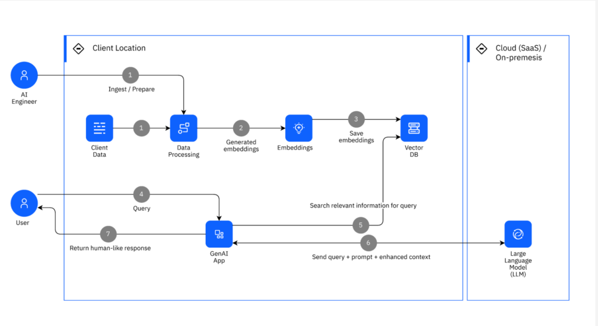

# A quick study of chunking techniques in RAG pipelines

## Introduction

Retrieval augmented generation (RAG) extends an LLM’s knowledge by preprocessing and indexing a document corpus. At query time, the system retrieves relevant passages, appends them to the user prompt, and sends the combined input to the model. This lets you work with effectively unlimited source data, rather than being constrained by the model’s context window.

RAG is not limited to text. Multimodal RAG can also compare audio, images, or other records against a corpus. A vector database stores embeddings of document chunks and ranks them by similarity to the user query, often using cosine similarity. The top-K results are included with the query to provide context to the LLM.

## What is chunking and why does it matter?

Chunking is the process of splitting documents into pieces before embedding them. The right chunking strategy is essential for a good RAG workflow.

Key points:
- Chunk size is independent of document length.
- Chunk sizes can vary within a single document.
- Smaller chunks improve retrieval precision but can lose context and produce incoherent answers.
- Larger chunks preserve context but may dilute relevance and increase token usage.

The best chunking strategy balances precision, context, and cost.

### Types of chunking

Common chunking approaches include:
1. Size-based chunking
2. Linguistic chunking
3. Structure-aware chunking
4. Context-preserving chunking
5. Adaptive chunking
6. Specialized chunking

A hybrid strategy can combine these approaches. In some cases, an LLM can also help generate better chunks, especially for high-value content such as financial reports or compliance documents.

## Chunking in common RAG frameworks

### LlamaIndex

LlamaIndex calls chunking node parsing and provides several parsers out of the box:
- Simple
- Recursive
- HTMLNodeParser
- JSONNodeParser
- MarkdownNodeParser

### LangChain

LangChain calls chunking "splitting" and supports several standard splitters:
- Text
- Recursive
- HTML
- Code
- Recursive JSON
- Semantic splitting
- Token-based splitting

### Custom chunking

Both frameworks support custom chunking logic:
- In LlamaIndex, subclass the `NodeParser` base class.
- In LangChain, subclass `BaseDocumentTransformer`.

Custom chunking lets you adapt to your own data structures and retrieval needs.
